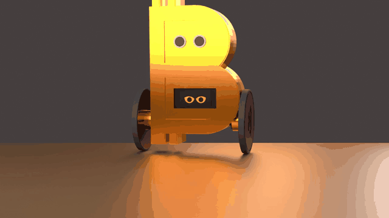
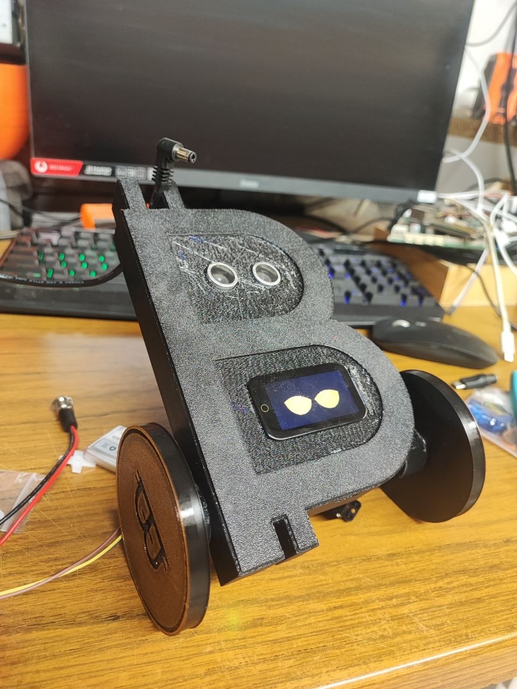
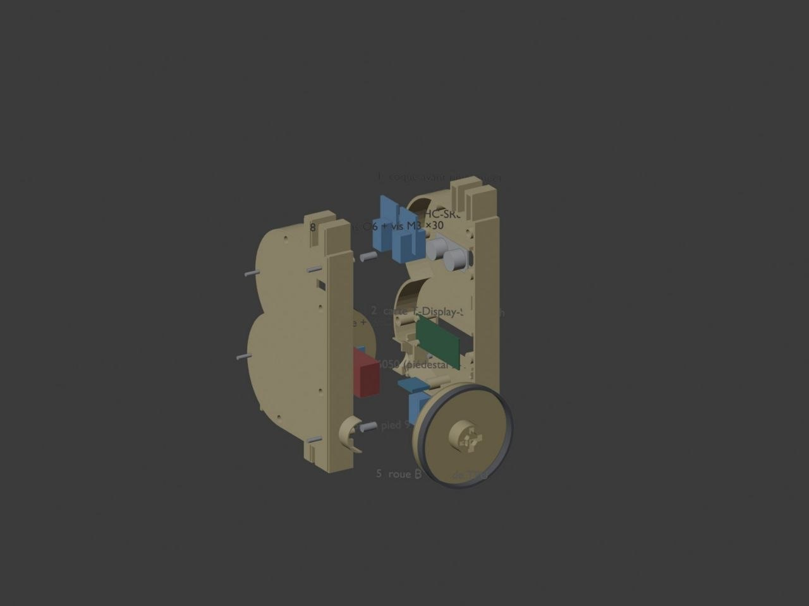

<div align="center">

# ₿ B-bot — le robot qui tient debout, en forme de Bitcoin

**ESP32-S3 · deux roues Ø83 mm · servos 360° · écran-visage · châssis imprimé en PETG**




*Rendu du châssis réel — [voir la vidéo complète (26 s)](docs/video-rendu.mp4)*

### [▶ Essayer le simulateur maintenant](https://silexperience210.github.io/balance-bot/simulateur.html)

*Rien à installer : ça tourne dans le navigateur, avec les vrais fichiers STL du châssis.*

</div>

---

## Le robot, en vrai



Le prototype imprimé en PETG. Le corps **est** le glyphe ₿ ; l'écran couleur lui fait
un visage, les deux capteurs à ultrasons tiennent lieu d'yeux, et les roues sont
chaussées de bandes TPU imprimées.

## L'idée

Un robot auto-équilibré classique tient sur deux roues grâce à un asservissement :
il mesure son inclinaison deux cents fois par seconde et commande ses roues pour
ramener son centre de gravité sous lui, en permanence, y compris à l'arrêt. Ici,
cette mécanique éprouvée porte une coque dessinée comme le symbole Bitcoin, avec un
écran qui lui donne une tête.

Ce dépôt contient **le firmware, le châssis (CAO + STL) et un simulateur** — dont un
simulateur web qui rejoue la même physique que le robot, dans le navigateur.

## Ce qu'il fait

- **Il se tient debout tout seul** — boucle d'équilibre à **200 Hz**, correcteur PID
  sur l'angle du pendule inversé, avec recentrage pour ne pas dériver.
- **Il réagit à ce qu'il voit** — un HC-SR04 scrute devant lui (portée utile 150 cm,
  arrêt d'urgence à 25 cm).
- **Il a un visage** — l'écran ST7789 dessine des yeux dont l'expression suit l'état
  réel du robot (équilibre, chute, batterie faible).
- **Il se règle à chaud** — on se connecte au point d'accès **`BalanceBot-Tune`**
  (http://192.168.4.1/) et on ajuste les gains avec des curseurs, en regardant la
  télémétrie, **sans recompiler**.
- **Il surveille sa batterie** — tension mesurée en continu, seuil bas à 3,5 V (et
  distinction « batterie faible » / « alimenté par USB »).

## Le simulateur

C'est la pièce maîtresse pour qui veut toucher au contrôle sans risquer un robot.

- **`sim/balancebot_sim.py`** — le modèle Python : pendule inversé 1D, **le même
  correcteur que le firmware**, et deux modes physiques (`roue` pour les servos
  360°, `arc` pour l'ancienne mécanique à pieds).
- **`sim/web/`** — le simulateur navigateur : moteur JavaScript **vérifié numéro à
  numéro contre la version Python** (même générateur aléatoire, écart nul sur les
  scénarios sans bruit), rendu **Three.js avec les vrais STL du châssis**, l'écran et
  son visage, un banc de six scénarios et tous les gains réglables au curseur.

### La règle d'or

> **Le simulateur et le firmware doivent dire la même chose.**

Toute divergence entre les deux est traitée comme un bug **du simulateur comme du
firmware** : la physique (rayon de roue, hauteur du centre de gravité, signe des
termes de commande), les butées et les seuils sont alignés des deux côtés. C'est ce
qui permet de régler des gains en simulation avant de risquer le robot — le
simulateur a par exemple écarté un `Ki` vingt fois trop faible qui ne pouvait pas
tenir debout.

## Sous le capot

| Élément | Détail |
|---|---|
| Carte | LilyGo T-Display-S3-Touch (ESP32-S3R8, 16 Mo flash, 8 Mo PSRAM) |
| Capteur d'assiette | MPU6050 (I2C 400 kHz, filtre complémentaire) |
| Écran | ST7789 170×320 (paysage), dalle tactile CST816 |
| Distance | HC-SR04 (broche ECHO avec diviseur de tension) |
| Actionneurs | 2× servos 9 g **à rotation continue** pour les roues (sélecteur 180°/360° à la compilation) |
| Batterie | 1S LiPo, mesure par ADC, seuil bas 3,5 V |
| Boucles | équilibre **200 Hz**, interface 60 Hz, tête/ultrason 50 Hz |
| Châssis | ₿ 132 × 46 × 201 mm, ~378 g (367 g PETG + 11 g TPU), voie 108 mm |



## Physique et réglage

Le robot est un pendule inversé : rayon de roue **R = 41,5 mm** (pneu Ø83), hauteur
du centre de gravité **H = 80 mm**, gravité 9,81 m/s². Les gains embarqués sont
`Kp 25 · Ki 500 · Kd 0,5`, avec une condition de stabilité utile : **Ki > g/R ≈ 300**
(pour un robot d'environ 40 mm de rayon effectif, un terme intégral trop faible ne
rattrape jamais une inclinaison lente).

Le réglage fin se fait au banc web, sans recompiler.

## Le dépôt

```
balance-bot/          FIRMWARE (ce qui tourne sur la carte)
  balance-bot.ino     assemblage + cadences (200 / 60 / 50 Hz)
  config.h            affectations des broches — source unique
  interfaces.h        BotState partagé (contrat entre modules)
  imu.cpp/h           MPU6050, filtre complémentaire, détection de figement
  balance.cpp         correcteur d'équilibre + recentrage
  feet.cpp/h          actionneur des roues (position ou rotation continue)
  head.cpp            tête pan/tilt + télémétrie ultrason
  battery.cpp/h       mesure batterie, seuils, hystérésis
  ui.cpp              écran + écran-visage + boutons
  tuner.cpp/h         banc de réglage web à chaud (AP BalanceBot-Tune)
chassis/              CAO : gen_bitcoin_bot.py, STL (v3/), NOTES_v3.md, rendus
sim/                  simulateur Python (même correcteur que le firmware)
  web/                simulateur navigateur (Three.js + STL réels)
docs/                 visuels et vidéo de présentation
TEST_PROTOCOL.md      protocole du premier essai debout (à lire avant d'allumer)
BACKLOG.md            suivi de la campagne d'amélioration
REVIEW_KIMI.md        revue de code indépendante (agent Kimi K3)
REVIEW_CLAUDE.md      contre-revue indépendante (agent Claude Opus)
```

## Méthode

Le firmware a été écrit et durci par **revues croisées d'agents** : une première
revue indépendante, puis une contre-revue chargée de contester la première — les
désaccords ont été tranchés en lisant le code, pas en votant. Elle a produit une
dizaine de corrections réelles (signe d'un terme de commande inversé entre le
simulateur et le firmware, butée logicielle inversée, zone morte qui transformait le
terme intégral en cliquet, garde batterie qui coupait en pleine action sur un seul
échantillon…). Les comptes rendus sont dans le dépôt, avec les correctifs.

## Avertissement

Projet personnel en cours de mise au point. Le firmware est fonctionnel et
compilable, mais les gains et la mécanique évoluent encore : lis `TEST_PROTOCOL.md`
avant la première mise sous tension, et ne pose jamais un robot équipé de servos sur
une table sans surveiller le premier essai.
